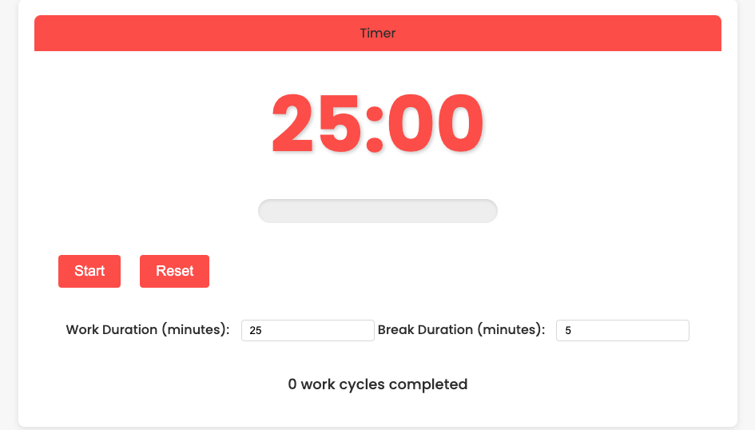

# Pomodoro Productivity Suite

## Overview

The Pomodoro Productivity Suite is a simple productivity tool that helps users manage their work and break intervals using the Pomodoro Technique. The Pomodoro Technique is a time management method that uses a timer to break work into intervals, traditionally 25 minutes in length, separated by short breaks.

This project includes a timer with customizable work and break durations, progress tracking, and the ability to reset work cycles. It also provides notifications for breaks and work intervals.

## Features

- **Customizable Timer:** Set your preferred work and break durations.
- **Progress Tracking:** Visualize progress with a progress bar.
- **Automatic Breaks:** Automatically start break intervals after work intervals.
- **Notifications:** Get notified when it's time for a break or when the work interval ends.
- **Work Cycle Reset:** Reset the count of completed work cycles.

## Technologies Used

- HTML
- CSS
- JavaScript

## Getting Started

To get started with the Pomodoro Productivity Suite, follow these steps:

1. Clone the repository to your local machine:

   ```
   git clone https://github.com/shantanum28/pomodoro-productivity-suite.git
   ```

2. Navigate to the project directory:

   ```
   cd pomodoro-productivity-suite
   ```

3. Start a local server using Python's built-in HTTP server:

   ```
   python3 -m http.server 8001
   ```

4. Open your web browser and visit [http://localhost:8000](http://localhost:8000) to view the application.

5. Customize the work and break durations as needed using the input fields.

6. Click the "Start" button to begin the timer.

7. Enjoy increased productivity by following the Pomodoro Technique!

## Usage

- Adjust the work and break durations using the input fields.
- Click the "Start" button to start the timer.
- During a work interval, focus on your tasks.
- When the work interval ends, take a short break.
- After completing a set number of work cycles, consider taking a longer break.
- Click the "Reset" button to reset the timer and work cycle count.

### Screenshots



## Contributing

Contributions are welcome! If you'd like to contribute to the project, please follow these steps:

1. Fork the repository.
2. Create a new branch (`git checkout -b feature-name`).
3. Make your changes.
4. Commit your changes (`git commit -am 'Add new feature'`).
5. Push to the branch (`git push origin feature-name`).
6. Create a new pull request.

## License

This project is licensed under the MIT License - see the [LICENSE](LICENSE) file for details.

---
Copyright © 2024 [Shantanu Meshram]